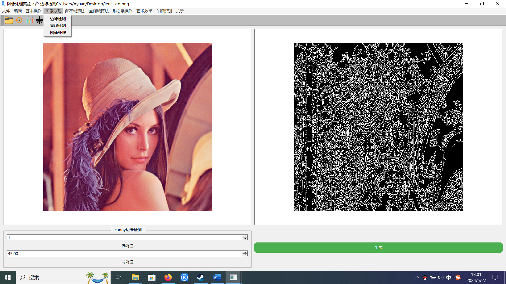
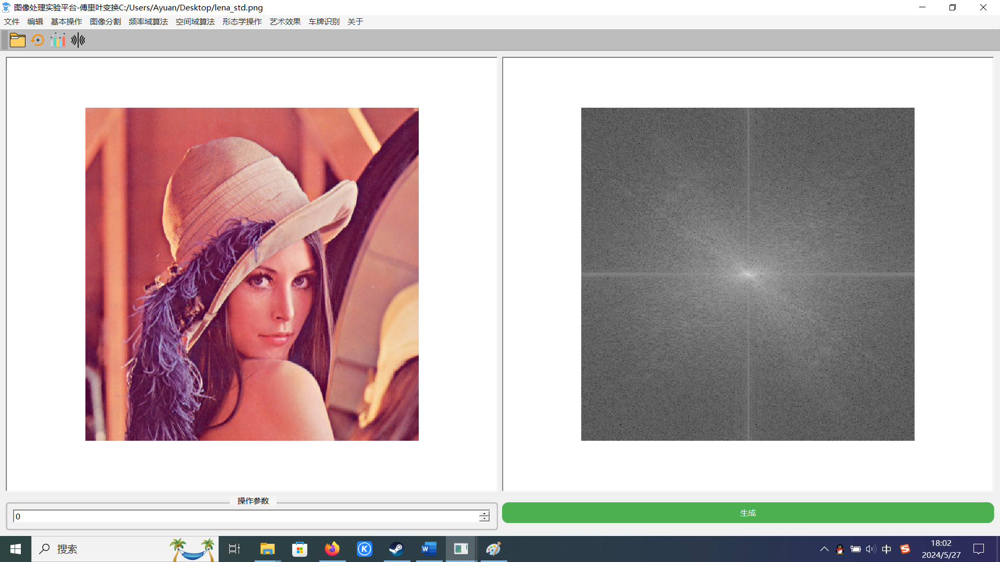
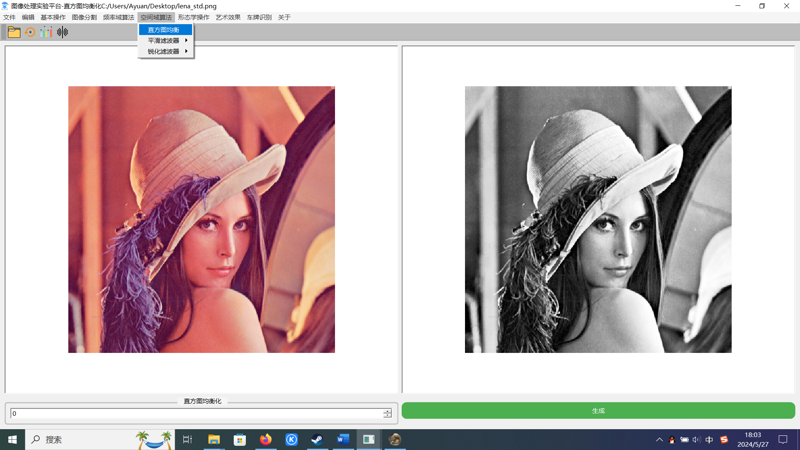
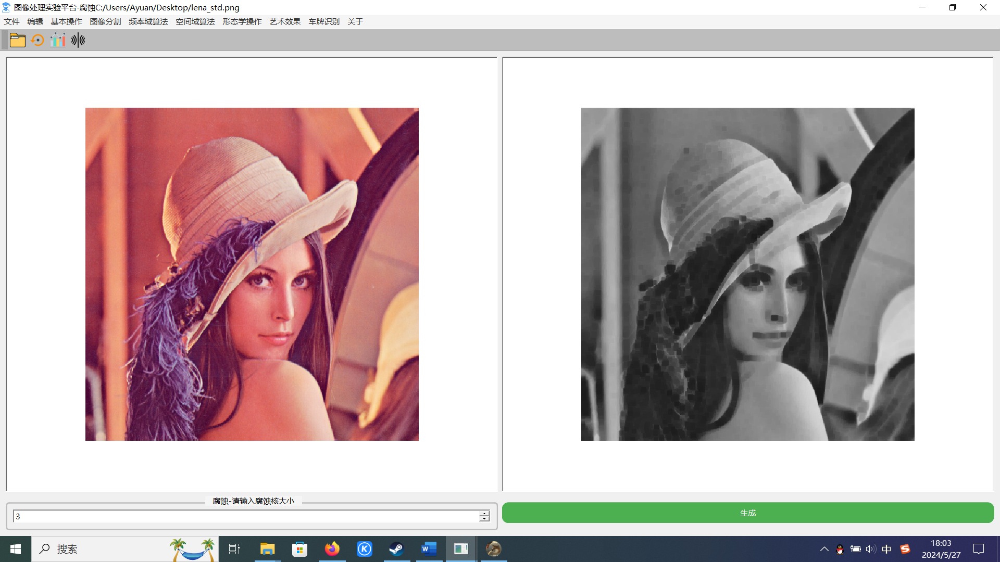
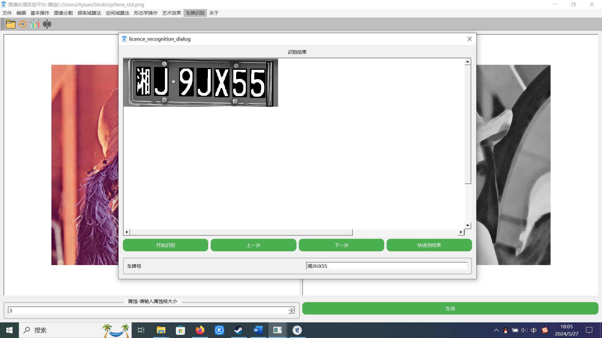
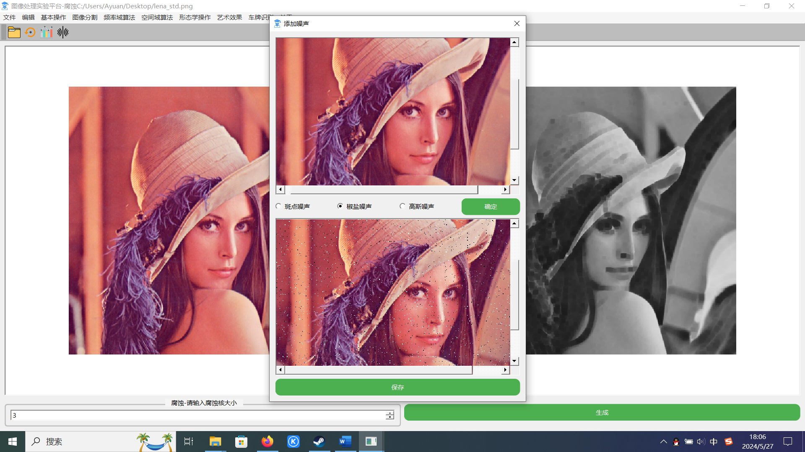
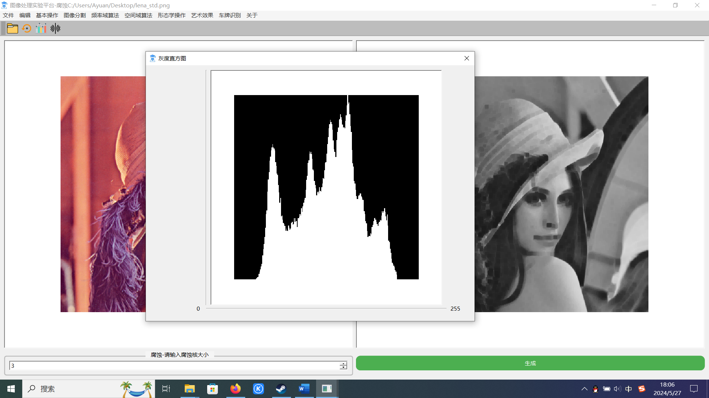

## 1.简介

这是我的毕业设计，最初的想法是因为在上数字图像处理这门课的时候，老师在课堂上批评我们不要老是弄些什么网站和管理系统，老师一直奋力的教学但是没什么人听，就想着写一个这样的桌面软件，或多或少可以有一点增进教学效果的作用，希望能有用吧。

## 2.技术框架

**GUI ：Qt 6.6**

图像处理库：**OpenCV 4.4.0**

Qt负责用户界面构建，OpenCV负责实现图像处理算法

## 3.开发环境

集成开发环境：**Clion**

编译工具：**cmake 3.2.4**

## 4.界面截图

1.基础算法-水平翻转

2.图像分割-边缘检测（canny算子）

3.频率域增强-傅里叶变换

4.空间域增强-直方图均衡

5.形态学操作-腐蚀

6.车牌识别

7.添加噪声

8.直方图

